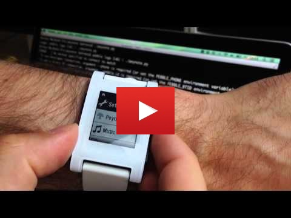

# Peynote

Disclaimer: This setup is for people who have some experience with the [Pebble SDK][PebbleSDK], the command line, and have a decent Python setup on their Mac.

If you follow the steps below you can use your Pebble smartwatch to remote control your [Keynote][Keynote] and [Deckset][Deckset] presentation without a Wifi or your phone, directly from your Mac via Bluetooth.

The Pebble app allows you to

 - go to the previous/next slide via the up/down buttons
 - quickly see the total time you spent on your presentation
 - see the time you spent on the current slide
  

 
 
## Installation

To make the work

1. clone this repository,
2. install the Pebble app via `pebble install`, and
3. run `peynote.py` to get further advice.

## Under the hood

When you run the `peynote.py` command it will respond with this simple message:

    usage: pebble logs 2>&1 | ./peynote.py

As you can see, this setup is a real hack!

The Pebble app you installed earlier uses `APP_LOG("UP")` to signal a button press to Pebble's standard log output.
The `pebble logs` command from the Pebble SDK receives these logs for every button your press in the app.
When piping this output to `peynote.py` it will scan for "UP" and "DOWN" to detect the relevant presses and
uses `ScriptingBridge` (Python's way to use AppleScript-enabled applications) to remote control your running Keynote instance.

## FAQ

### Can I use it with Deckset?

Yes. Due to popular demand, this hack now supports both, [Keynote][Keynote] and [Deckset][Deckset]. It basically works the same way: just start your presentation and use Peynote to control it from your wrist.

### Do I need a Wifi/Phone for this?

Nope.
Use the `pebble` command with `--pebble_id` or the `PEBBLE_BTID` environment variable to establish a bluetooth connection directly from your Mac.

NOTE: This requires [Python lightblue to be installed][lightblue].

### Can I still use my phone?

Sure!
Use the `pebble` command with the `--phone` or the `PEBBLE_PHONE` environment variable [as suggested by the Pebble SDK setup][PebbleHelloWorld].
You will have to put the official Pebble app into the *developer mode*, also your Mac and the phone have to be on the same Wifi.

[lightblue]: http://forums.getpebble.com/discussion/comment/111815/#Comment_111815
[PebbleSDK]: https://developer.getpebble.com/2/getting-started/macosx/
[PebbleHelloWorld]: https://developer.getpebble.com/2/getting-started/hello-world/
[Keynote]: https://www.apple.com/mac/keynote/
[Deckset]: http://decksetapp.com
